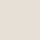
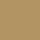
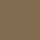

# ☕ Serenatto - Café & Bistrô

## 📌 Sobre o Projeto

O **Serenatto** é um website moderno e responsivo para uma cafeteria fictícia que oferece uma variedade de serviços incluindo café & bistrô, buffet para eventos e delivery. Utilizando a abordagem *mobile-first* sendo desenvolvido com **HTML5**, **CSS3**, **JavaScript** e **Bootstrap 5**, o site apresenta um design aconchegante com uma paleta de cores em tons terrosos, criando uma atmosfera calorosa e convidativa.

## 🛠️ Tecnologias Utilizadas

✔️ **HTML5** - Estrutura semântica da página

✔️ **CSS3** - Estilização customizada com variáveis CSS

✔️ **JavaScript** - Funcionalidade do modo noturno

✔️ **Bootstrap 5.3** - Framework CSS para responsividade e componentes

✔️ **Bootstrap Icons** - Ícones para redes sociais e interface

✔️ **Google Fonts** - Fonte Barlow para tipografia

## ✨ Funcionalidades

- Design Responsivo: Adaptável para diferentes tamanhos de tela (desktop, tablet e mobile)

- Modo Noturno: Toggle para alternância entre tema claro e escuro

- Menu Interativo: Navegação com offcanvas para dispositivos móveis

- Modais Informativos: Detalhes sobre produtos específicos

- Formulário de Contato: Seção para coleta de informações dos clientes

- Animações Suaves: Transições e efeitos hover para melhor experiência do usuário  

## 🚀 Experiência com o Projeto

Como parte do meu nono projeto realizado com o apoio das aulas da [Alura](https://www.alura.com.br/), o desenvolvimento do **Serenatto** foi uma experiência envolvente e repleta de evolução prática. Ao longo do processo, pude aprofundar conhecimentos, superar desafios e consolidar habilidades fundamentais para o desenvolvimento de interfaces modernas e interativas.

Este projeto foi uma jornada de aprendizado marcante, com destaque para a primeira implementação do *modo noturno* utilizando **data-bs-theme** do Bootstrap e variáveis CSS customizadas. Explorei componentes avançados do Bootstrap como *modais*, *accordions* e *offcanvas*, enfrentando desafios como responsividade, integração entre CSS/JavaScript e estruturação de múltiplos modais.

Essa experiência aprimorou meu domínio sobre os componentes, técnicas de debugging e organização de código, além de reforçar conceitos de acessibilidade e usabilidade em interfaces dinâmicas.

## 📂 Estrutura do Projeto

```txt
serenatto/
│
├── assets/             # Imagens e recursos
│   ├── logo.png
│   ├── logo-mobile.png
│   ├── banner-1.png
│   ├── banner-2.png
│   ├── banner-3.png
│   └── produtos-*.png
│
├── Cores/              # Cores do README
│   ├── bege.svg
│   ├── branco.svg
│   ├── marrom-claro.svg
│   ├── marrom-escuro.svg
│   └── preto
│
├── estilos.css         # Estilos customizados
│
├── index.html          # Página principal
│
├── script.js           # Funcionalidades JavaScript
│
└── README.md
```

## 🎨 Paleta de Cores

| Cor           | Hex       |                  Amostra                  |
| ------------- | --------- | :---------------------------------------: |
| Bege          | `#E6E0D6` |                    |
| Branco        | `#FFFFFF` |                |
| Marrom Claro  | `#B29463` |    |
| Marrom Escuro | `#816D4F` |  |
| Preto         | `#000000` |                  |

## 📜 Licença

Este projeto está sob a licença [MIT](https://opensource.org/licenses/MIT) — originalmente criado para estudos, sinta-se livre para utilizar e modificar!
